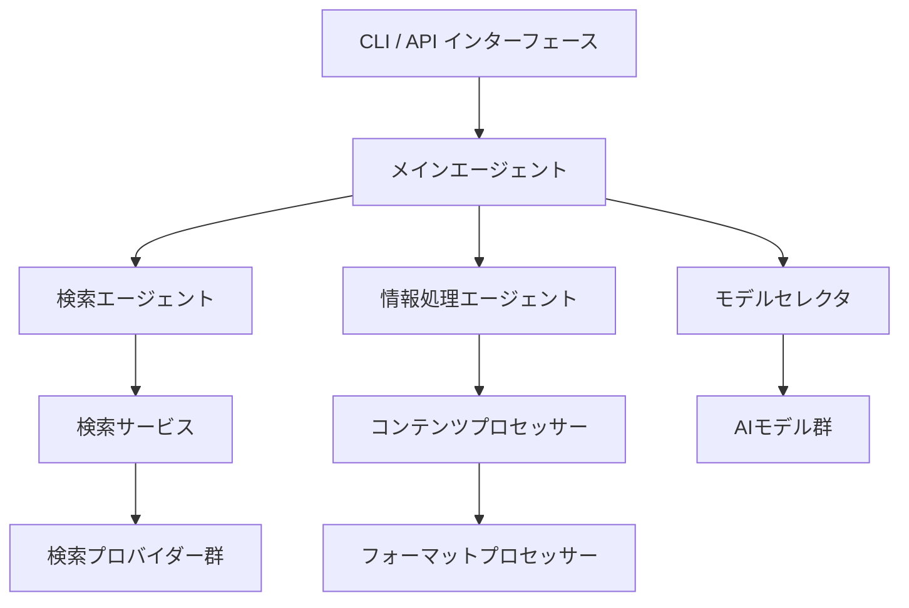
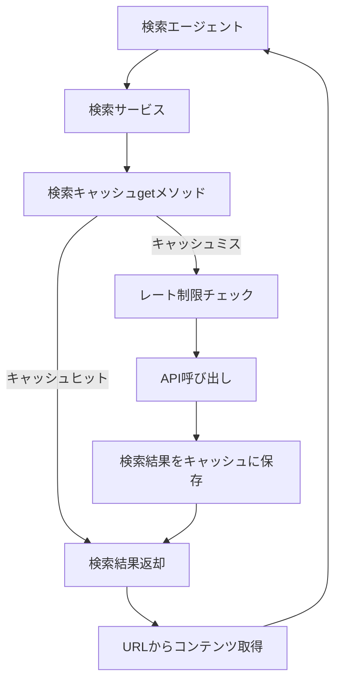
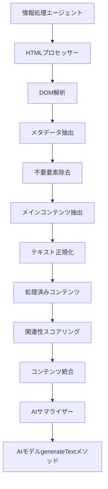
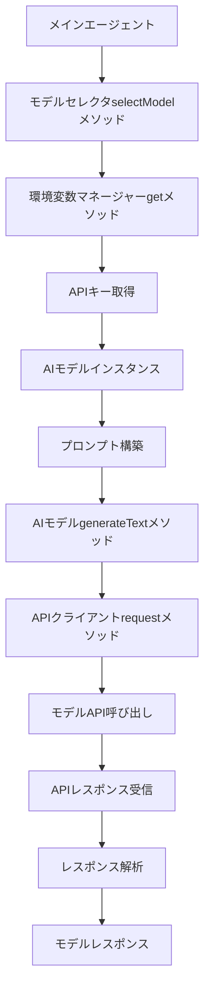
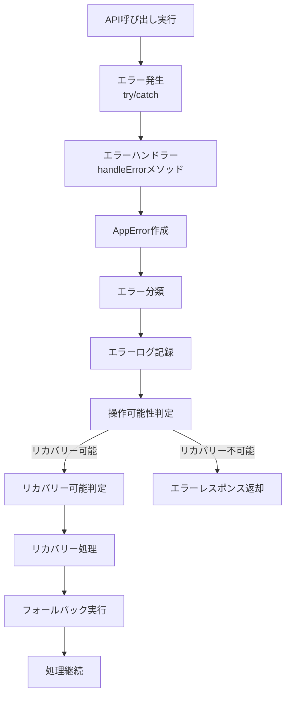
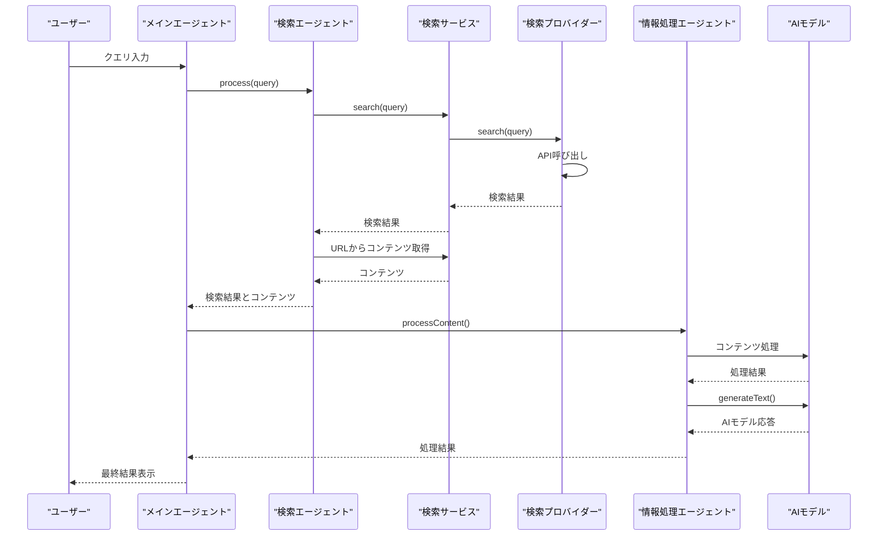
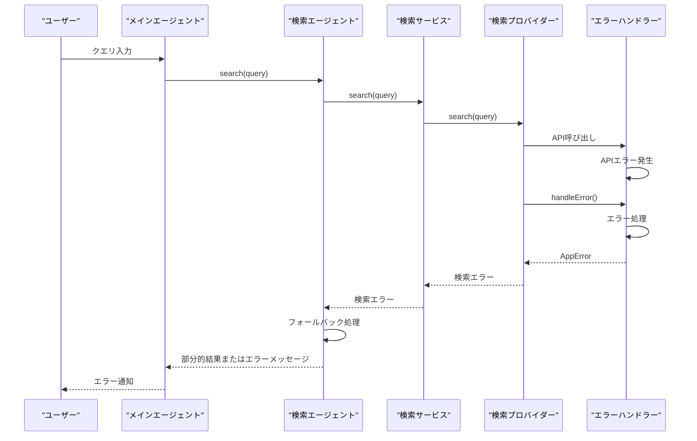
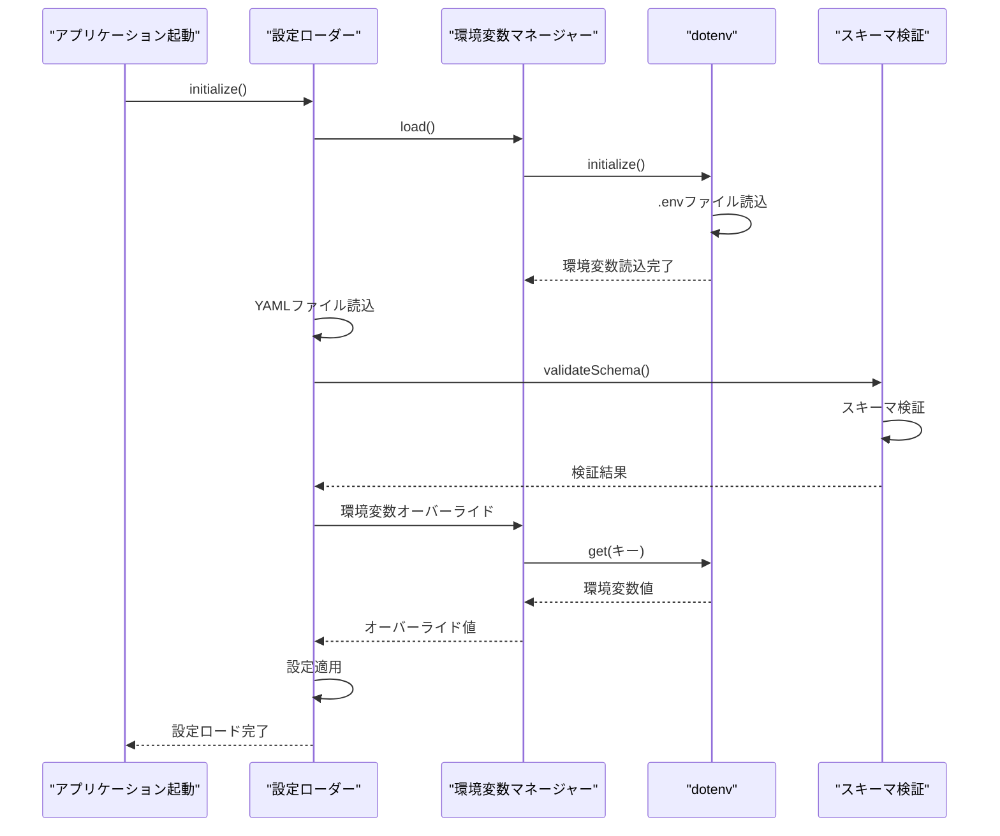
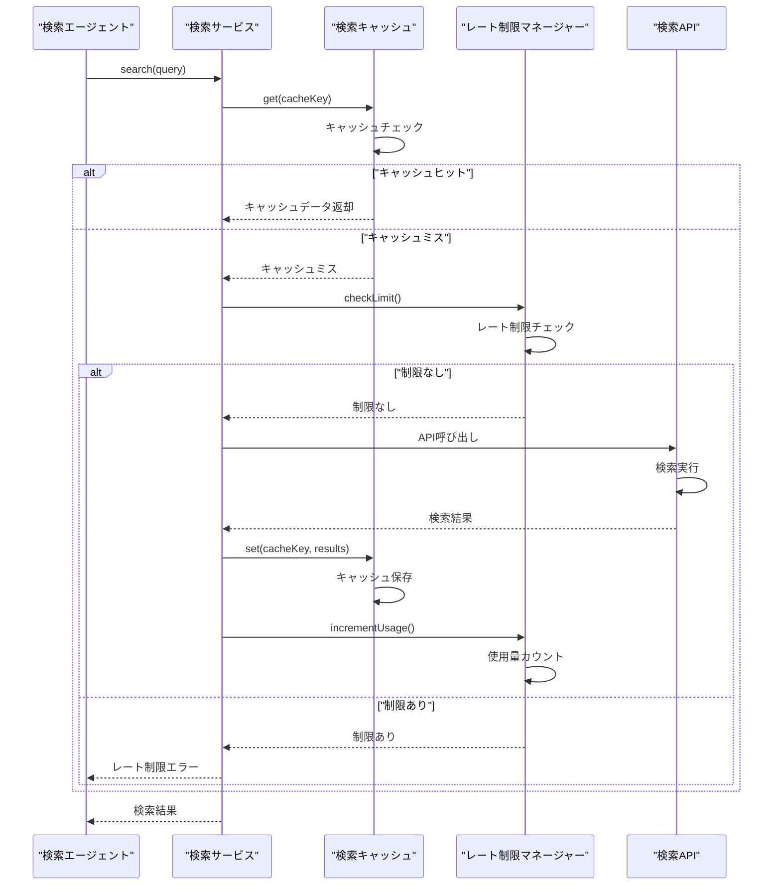
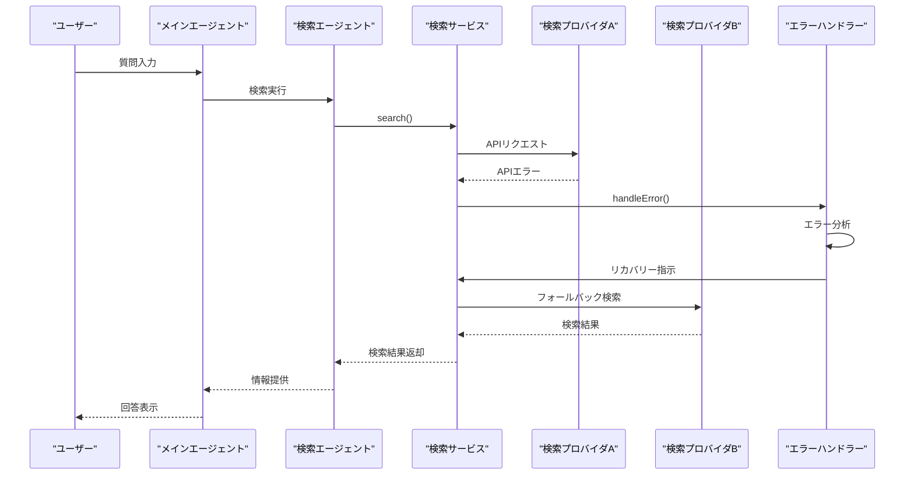

# 情報収集エージェント 詳細設計図（Mermaid形式）

## 1. 全体アーキテクチャ

## 2. データフロー図

### 2.1 検索フロー

### 2.2 コンテンツ処理フロー

### 2.3 AIモデル呼び出しフロー

### 2.4 エラーハンドリングフロー

## 3. シーケンス図

### 3.1 基本的なクエリ処理シーケンス

### 3.2 エラー発生時のシーケンス

### 3.3 環境変数ロード・設定シーケンス

### 3.4 キャッシュとレート制限シーケンス

### 3.5 検索リカバリーシーケンス

