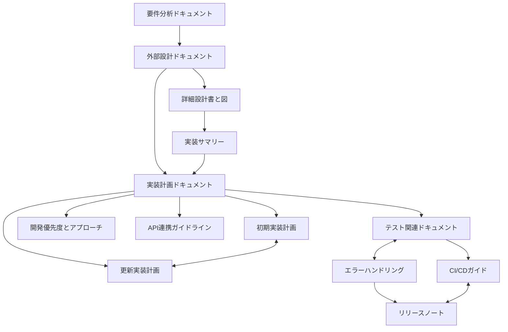

# 情報収集エージェントシステム - ドキュメント概要

## ドキュメント一覧と関連性

### 1. 要件分析ドキュメント ([requirements_analysis.md](requirements_analysis.md))
- システムの基本的な要件と機能を定義
- 主要機能要件、非機能要件の詳細
- 制約条件と課題の整理
- 成功基準の設定

### 2. 外部設計ドキュメント ([external_design.md](external_design.md))
- 要件分析に基づくシステム構成の設計
- コンポーネント間の関係性定義
- インターフェース設計（外部/内部）
- データ構造とフローの設計
- エラーハンドリング方針
- セキュリティ設計

### 3. 詳細設計ドキュメント
#### 3.1. 詳細設計書 ([detailed_design_document.md](detailed_design_document.md))
- システムの詳細設計と実装仕様
- コンポーネント詳細設計
- データフロー詳細
- シーケンス図
- クラス・関数詳細
- エラーハンドリング設計

#### 3.2. 詳細設計図（Mermaid形式） ([detailed_design_document_mermaid.md](detailed_design_document_mermaid.md))
- 全体アーキテクチャ図
- データフロー図（検索、コンテンツ処理、モデル呼び出し、エラーハンドリング）
- シーケンス図（クエリ処理、エラー処理、環境変数ロード、キャッシュ制御、検索リカバリー）

### 4. 実装計画ドキュメント
#### 4.1. 初期実装計画 ([implementation_plan.md](implementation_plan.md))
- 外部設計に基づく実装の計画
- 開発環境と技術スタックの選定
- フェーズ別の実装スケジュール
- テスト計画と品質管理方針
- デプロイと運用計画
- リスク管理戦略

#### 4.2. 更新された実装計画 ([implementation_plan_updated.md](implementation_plan_updated.md))
- 現在の実装状況の詳細分析
- 課題と問題点の特定
- フェーズ別の詳細タスクリスト
- マイルストーンとタイムラインの再定義
- リソース計画の更新
- 技術的負債と今後の課題

#### 4.3. 2025年更新実装計画 ([implementation_plan_2025.md](implementation_plan_2025.md))
- 2025年に向けた実装計画の更新
- 長期的な技術ロードマップ
- 拡張機能の計画
- 持続可能な開発アプローチ

#### 4.4. 2025年更新実装計画（更新版） ([implementation_plan_2025_updated.md](implementation_plan_2025_updated.md))
- 前回の2025計画からの変更点と対応策
- 実績に基づく計画の調整
- 新技術の取り込み方針

#### 4.5. 最終実装計画 ([implementation_plan_final.md](implementation_plan_final.md))
- 全フェーズを通しての最終実装計画
- 完了基準と検証方法
- 運用・保守フェーズへの移行計画

### 5. 実装サマリー ([implementation_summary.md](implementation_summary.md))
- 実装済み機能の概要
- 使用技術とライブラリ
- コードベースの構成と依存関係
- 実装上の工夫と特徴

### 6. 開発優先度とアプローチ ([development_priority.md](development_priority.md))
- 開発の基本方針
- 優先度の考え方と基準
- フェーズ別の優先タスク
- 並行開発の方針
- 進捗管理方法
- 成功の評価基準
- プロジェクト完了後のサポート計画

### 7. API連携ガイドライン ([api_integration_guide.md](api_integration_guide.md))
- AIモデルAPI連携方法
- 検索API連携方法
- API設定と認証
- エラーハンドリング
- パフォーマンス最適化
- APIのバージョン管理
- トラブルシューティング

### 8. 検索API設定ガイド ([search_api_setup.md](search_api_setup.md))
- 検索APIの設定と構成
- キーの取得と管理方法
- 制限と使用上の注意点
- 検索結果のフォーマットと処理

### 9. テスト関連ドキュメント
#### 9.1. テスト計画 ([test_plan.md](test_plan.md))
- テスト戦略と範囲
- テスト環境と前提条件
- テストケースの設計
- テスト実行計画

#### 9.2. 更新テスト計画 ([test_plan_updated.md](test_plan_updated.md))
- 初期テスト結果を踏まえた計画の更新
- テスト範囲の見直しと拡大
- 新規テストケースの追加

#### 9.3. 2025年更新テスト計画 ([test_plan_updated_2025.md](test_plan_updated_2025.md))
- 2025年に向けた長期テスト計画
- 自動化テスト戦略の強化
- 継続的インテグレーションの改善点

#### 9.4. テストロードマップ ([test_roadmap.md](test_roadmap.md))
- フェーズ別のテスト計画
- マイルストーンとタイムライン
- リソース配分

#### 9.5. テスト結果 ([test_results.md](test_results.md))
- テスト実行結果のサマリー
- 発見された問題と解決策
- 品質メトリクス

#### 9.6. テスト実行結果 ([test_execution_results.md](test_execution_results.md))
- 詳細なテスト実行結果
- 合格/不合格の統計
- 性能テスト結果

#### 9.7. テスト実行概要 ([test_execution_summary.md](test_execution_summary.md))
- テスト実行の全体概要
- 主要な成果と課題
- フォローアップ項目

#### 9.8. テスト概要 ([test_summary.md](test_summary.md))
- テスト活動の要約
- テスト範囲と結果の概要
- 品質状態の評価

#### 9.9. テスト失敗分析 ([test-failures-analysis.md](test-failures-analysis.md))
- テスト失敗の詳細分析
- 根本原因の特定
- 対応策と予防措置

#### 9.10. テストベストプラクティス ([test_best_practices.md](test_best_practices.md))
- 単体テスト作成ガイドライン
- 統合テスト作成ガイドライン
- モック・スタブの使用方法
- テスト自動化のベストプラクティス

#### 9.11. RAGとエージェントテスト ([test_rag_and_agent.md](test_rag_and_agent.md))
- RAG（検索拡張生成）機能のテスト方法
- エージェントの振る舞いテスト
- 統合テストシナリオ

### 10. エラーハンドリング関連
#### 10.1. エラーハンドリング設計 ([error-handling.md](error-handling.md))
- エラー処理の基本方針
- エラータイプと対応戦略
- リカバリーメカニズム
- ユーザーへのエラー表示方法

#### 10.2. エラーハンドリング結果 ([error-handling-results.md](error-handling-results.md))
- エラーハンドリングの評価結果
- 改善点と対応策
- エラーパターンの分析

### 11. CI/CD関連
#### 11.1. CI/CDガイド ([ci_cd_guide.md](ci_cd_guide.md))
- 継続的インテグレーション/デリバリーの設定
- ワークフロー設計
- テスト自動化
- デプロイプロセス

### 12. プロジェクト構造 ([project_structure.md](project_structure.md))
- ディレクトリ構成
- コンポーネント間の関係
- ファイル命名規則
- モジュール構成の解説

### 13. リリースノート ([release-notes.md](release-notes.md))
- 各バージョンの変更内容
- 新機能と改善点
- 修正されたバグ
- 既知の問題と制限事項

## ドキュメント間の関連性マップ

## 実装状況と次のステップ

### 現在の実装状況

1. **プロジェクト基盤**：
   - プロジェクト構造とディレクトリ構成
   - TypeScript設定、ESLint、Prettier設定
   - 設定ファイル構造

2. **ユーティリティ**：
   - エラーハンドラー
   - ロギング機能
   - 型定義

3. **モデル基盤**：
   - モデルインターフェース
   - ベースモデル
   - モデルセレクタ
   - Anthropicモデル（部分実装）
   - OpenAIモデル（部分実装）
   - Googleモデル（実装開始）

4. **実装済みコンポーネント**：
   - 設定ローダー
   - メインエージェント（基本実装）
   - 検索エージェント（機能実装）
   - 情報処理エージェント（基本実装）
   - コンテンツプロセッサー（HTML/PDF）

5. **エラーハンドリング**：
   - エラー種別定義
   - リカバリーメカニズム
   - フォールバック処理

6. **RAG機能**：
   - 基本的なRAG処理フロー実装
   - コンテキスト構築処理
   - 情報統合処理

### 課題と問題点

1. **型の不一致**：
   - SearchResult型の定義と実装の不一致（修正中）
   - 設定ファイル構造の整合性（改善済み）

2. **モデル実装の不完全さ**：
   - AnthropicModelの実装の改善（完了）
   - OpenAIモデルの実装（部分完了）
   - Googleモデルの実装（進行中）
   - モデルセレクタのフォールバック機能（改善中）

3. **検索機能とコンテンツ処理の制限**：
   - レート制限制御の最適化
   - 複雑なHTMLの処理精度
   - PDFからの構造化データ抽出精度

### 優先的に取り組むべき項目

現在のフェーズ（1週間）:
- Googleモデル実装の完了
- モデルセレクタのフォールバック機能強化
- エラーハンドリングの総合テスト

次のフェーズ（2-3週間）:
- RAG機能の拡張と最適化
- 検索機能の性能改善
- コンテンツ処理精度の向上

将来フェーズの詳細は、[implementation_plan_final.md](implementation_plan_final.md)と[development_priority.md](development_priority.md)を参照してください。

## 要件から実装への追跡マトリクス

| 要件ID | 要件概要 | 外部設計の関連セクション | 実装計画の対応モジュール | ステータス |
|--------|----------|------------------------|------------------------|-----------|
| R1.1   | URL情報取得 | 4.2 検索API設計 | WebCrawler | 実装済み |
| R1.2   | ファイル情報取得 | 2.1 入力インターフェース | FileProcessor | 部分実装 |
| R2.1   | Claude対応 | 4.1 AIプロバイダーAPI | AnthropicProvider | 実装済み |
| R2.2   | モデル切替 | 1.3 AIモデル統合層 | ModelSelector | 実装済み |
| R2.3   | OpenAI対応 | 4.1 AIプロバイダーAPI | OpenAIProvider | 部分実装 |
| R2.4   | Google対応 | 4.1 AIプロバイダーAPI | GoogleProvider | 実装中 |
| R3.1   | マークダウン出力 | 2.1 出力インターフェース | ReportGenerator | 実装済み |
| R4.1   | ログ管理 | 3.1 データ構造(ログデータ) | Logger | 実装済み |
| NF1.1  | パフォーマンス要件 | 5.2 エラー処理方針 | PerformanceMonitor | 部分実装 |
| NF2.1  | セキュリティ | 6. セキュリティ設計 | SecurityManager | 実装済み |
| C1.1   | LangChain v0.3対応 | 1.2 主要コンポーネント | LangChainWrapper | 実装済み |

## ドキュメント更新履歴

| 日付 | バージョン | 更新内容 | 更新者 |
|------|------------|----------|--------|
| 2025-03-07 | 1.0 | 初版作成 | システム設計チーム |
| 2025-03-07 | 1.1 | レビュー結果に基づく改善 | システム設計チーム |
| 2025-03-08 | 2.0 | 新規ドキュメント追加と実装状況更新 | 開発チーム |
| 2025-03-09 | 2.1 | 詳細設計書とMermaid図のドキュメント追加 | 開発チーム |
| 2025-03-09 | 2.2 | エラーハンドリングと実装状況の更新 | QAチーム | 
| 2025-03-10 | 2.3 | ドキュメントにリンク追加、図をMermaid形式に変換 | 開発チーム | 